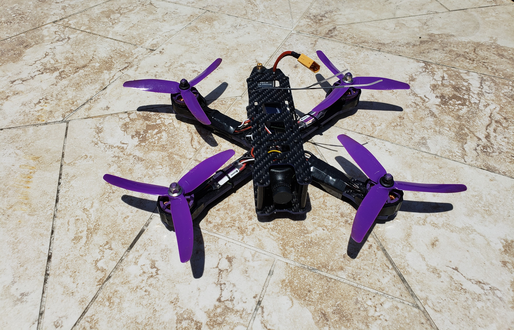
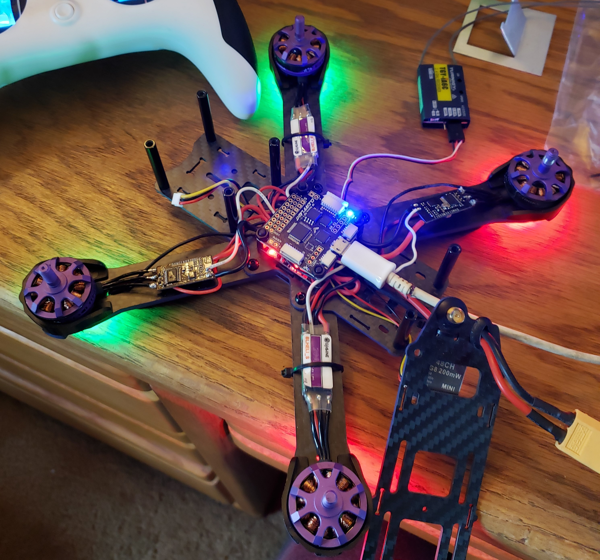

# UCSC_Thesis
This repository contains all files needed to compile my thesis on PID controller theory and quadcopter dynamics. A complete version of the document can me seen in the file Ramirez_thesis.pdf
Please do not commit PDF's, Auxfiles, or other short-lived results of compiling LaTeX. This makes the repository messy. Only commit tex, bibtex, png, jpg, etc, as necessary to compile.

